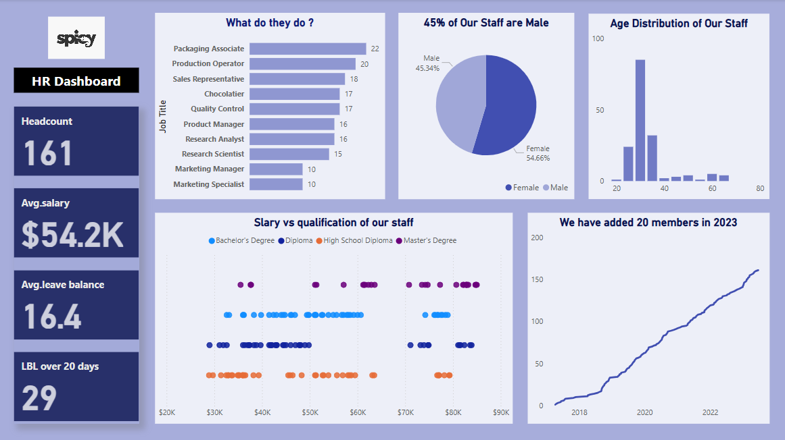

# HR Analysis Dashboard – Power BI  

This project is an HR Analysis Dashboard built using Power BI. It provides HR professionals with insights into employee data, helping them make data-driven decisions.  

Key Features :
- **Data Cleaning & Transformation**: Used Power Query to clean and prepare HR data.  
- **HR Metrics**: Headcount, average leave balance, and salary analysis.  
- **Salary & Education Analysis**: Examined relationships between salary and education qualification.  
- **Top/Bottom Paid Employees**: Used filters to analyze highest and lowest-paid staff in different roles.  
- **Advanced DAX Calculations**: Cumulative headcount, leave balance greater than 20 days.  
- **Customized Visuals**: Adjusted colors, axes, labels, and legends for better readability.  

Technologies Used :
- Power BI  
- Power Query  
- DAX (Data Analysis Expressions)  

Files Included : 
- 'HR dashboard.pbix' – Power BI dashboard file  
- 'hr-data.xlsx' – Sample dataset used in the analysis  
 
  
